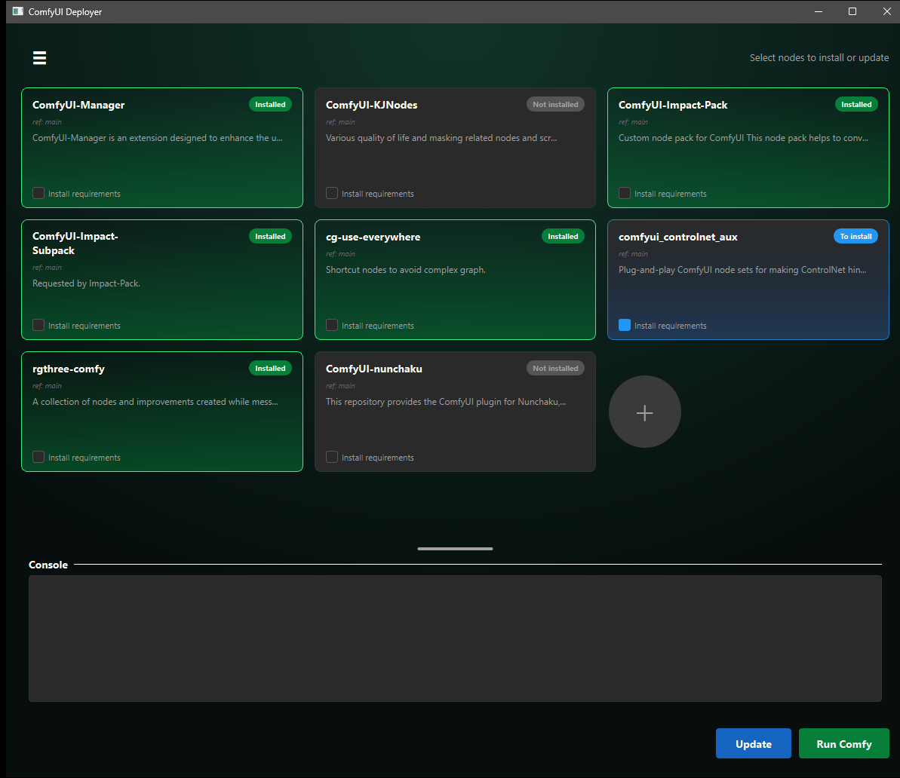
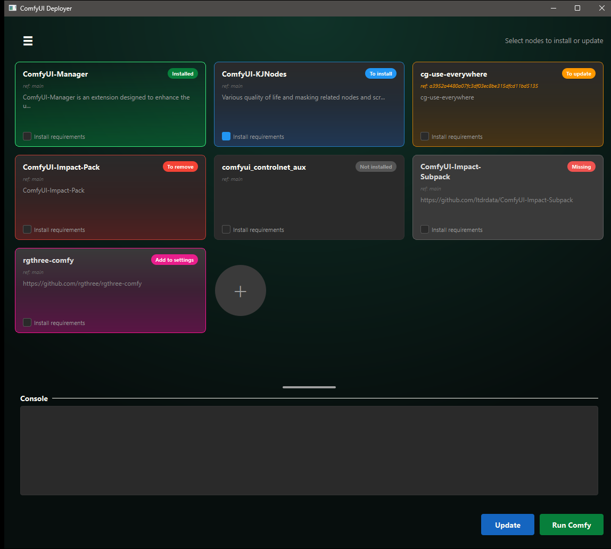
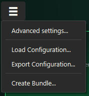
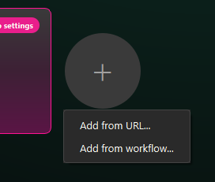
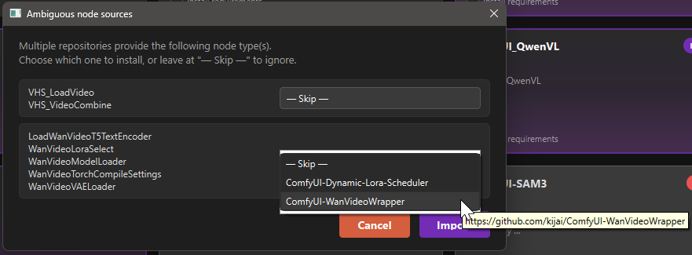
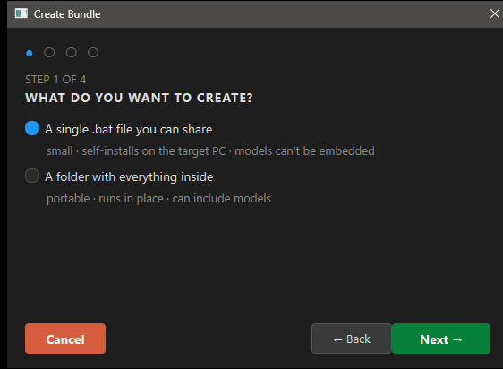
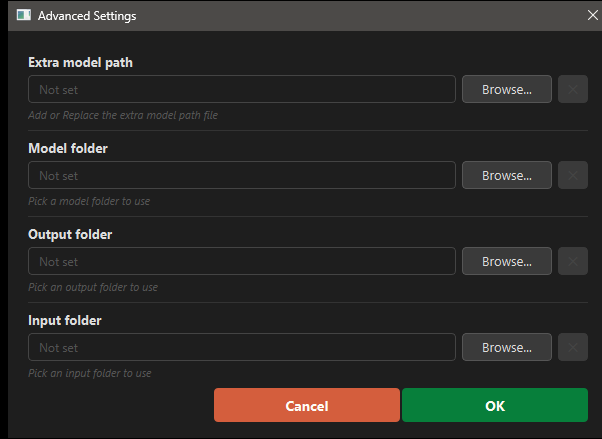

# ComfyUI Deployer

A desktop app for managing custom nodes/intalls for [ComfyUI](https://github.com/Comfy-Org/ComfyUI/). 
It allow to : 
- Packages the configuration into a self-contained portable bundle.
- Create single shareable self-installing `.bat`
- Install custom nodes from any versions, commit or branch
- Create and export custom nodes configuration 
- Create a bundle from a comfyUi workflow. 
- Update configuration from a ComfyUi workflow



## Features

- **Visual node management** — each tracked node is shown as a card with its name, git ref, description, and a "Install requirements" toggle. Click a card to mark it for install / uninstall. Double click on ref allow you to change the custom node version.
- **Automatic update check** — on startup, the app fetches each installed node in the background and flags cards that are behind their remote branch with a yellow **"Need update"** badge. Click the card to arm it for update (turns amber **"To update"**), then press Update to pull the latest commits. Cards turn amber immediately when the configured ref drifts from what's on disk.
- **Orphan detection** — custom nodes installed inside `ComfyUI/custom_nodes/` but not present in configuration show up as orphan cards. Select them to promote them into the tracked list.
- **Add from workflow** — point the app at a ComfyUI workflow JSON. It diffs the workflow's node types against built-in nodes + currently installed custom nodes, and resolves the rest against the ComfyUI-Manager DB. Ambiguous types are surfaced via a conflict dialog.
- **Bundle export** — produce either a portable ComfyUI folder or a single shareable self-installing `.bat`. Optionally trim the output to only the custom nodes (and models, in folder mode) referenced by selected workflows. Missing nodes are auto-cloned so the result boots without any extra setup.
- **Run ComfyUI** — start/stop the bundled ComfyUI subprocess from the app, with stdout/stderr piped into an integrated console panel.

## Quick start

1. Clone this repo into the folder where you want ComfyUI deployed.
2. Make sure [7-Zip](https://www.7-zip.org/) is installed.
3. Double-click **`Launch.bat`**. The script will:
   - Download `ComfyUI_windows_portable_nvidia.7z` from the official release page and extract it next to the script (on first run).
   - Install python requirement into the bundled `python_embeded` if needed.
   - Launch the deployer.

The app use the bundled Python used by comfyUI under (`ComfyUI_windows_portable/python_embeded/python.exe`)

## Usage

### Tracking nodes

The main window lists every node in `user_settings.json` plus any orphan installed nodes (under custom_nodes folder from ComfyUI). Click a card to toggle install/uninstall, double-click the ref or description to edit them inline, and right-click for the "Remove from list" action or be redirected to the node repository.



The hamburger menu (top-left) hosts the entry points for everything else:



Add nodes from the `+` button



### Adding nodes from a workflow

`☰ → Add from workflow(s)...` parses ComfyUI workflow(s) JSON, drops the built-in / already-installed node types, then queries the ComfyUI-Manager DB for the rest. Unambiguous matches are added as orphan cards automatically; types satisfied by multiple repos pop up a conflict picker:



### Creating a portable bundle

`☰ → Create Bundle...` opens a 5-step wizard.



1. **What do you want to create?** — choose the output format:
   - **A single `.bat` file you can share** *(default)* — a small, self-installing script. On the recipient's machine, it clones the ComfyUI Deployer, downloads the matching ComfyUI portable, installs `PyQt6` / `pyyaml` / `uv` into the embedded python, recreates `user_settings.json`, then clones the selected custom nodes and installs their requirements. **Models are never embedded** in this mode.
   - **A folder with everything inside** — a portable bundle that runs in place. Can include the models.
2. **Destination** — pick the folder where the bundle (or the `.bat`) will be written.
3. **Scope** *(optional)* — pick one or more workflow JSONs to trim the bundle to only what they need (custom nodes, and models if enabled). Missing workflow nodes are resolved against the ComfyUI-Manager DB and cloned directly into the bundle's `custom_nodes/`, so the resulting bundle is self-contained. Skip this step to bundle the full ComfyUI install.
4. **Options** — the available options depend on the output format chosen at step 1:
   - In **folder** mode: `Include models`, `Include the ComfyUI Deployer tool`, and — if step 3 was filled — `Copy the workflow files into the bundle`.
   - In **`.bat`** mode: `Embed advanced settings` (writes `extra_model_paths.yaml` and the model/output/input overrides into the `.bat`, so an external model library can be wired up on the target machine), and — if step 3 was filled — `Embed the workflow files into the .bat`. ComfyUI Deployer is always included in this mode.
5. **Install steps** *(optional)* — add custom steps contributed by plugins (see [Plugins](#plugins) below). Each step runs at bundle creation (`CREATE` phase, on the author's machine) and/or when the recipient installs the bundle (`INSTALL` phase).


### Plugins

Plugins let you add custom steps to the bundle lifecycle — for example copying models from a shared folder, patching config files, or running arbitrary scripts on the recipient's machine.

#### Local plugins (private, per-machine)

Drop any `.py` file into the **`plugins/`** folder at the root of the repo. This folder is **gitignored** (only its `README.md` and the disabled example are tracked), so the plugins you drop there stay private to your machine and are never pushed to the remote. The deployer auto-discovers every `.py` file there; the steps they register appear in the Create Bundle wizard under **Install steps → ＋ Add step**.

When you export a bundle, local plugins travel with it automatically:
- **`.bat` export** — plugin files are packed into a base64-encoded tar and extracted into `plugins/` before `headless_install` runs.
- **Folder export** — plugin files are copied directly into `<bundle>/plugins/` alongside the deployer clone.

A fully annotated example is available in [`plugins/example_copy_models_from_root.py`](plugins/example_copy_models_from_root.py) (disabled by default).

#### Remote plugins (shared via git)

Remote plugins live in a public or private git repo. They are listed by URL + branch/tag in `user_settings.json` under `"plugins" → "remote"`, cloned into `plugins/remote/<name>/` on first use, and discovered alongside local plugins.

Manage remote plugins from **`☰ → Manage Plugins...`**:

- **Add** — enter the repo URL and an optional ref (branch, tag, or commit). The deployer clones it immediately.
- **Update** — pull the latest commits for a remote plugin.
- **Remove** — delete the local clone and remove the entry from settings.

At startup, the deployer silently clones any remote plugins that are listed in settings but not yet on disk, so the team can share a `user_settings.json` with a plugin list and everyone gets the plugins on first launch.

When you export a bundle with remote plugins checked in step 5:
- **`.bat` export** — the repo URL + ref is embedded in `user_settings.json`; the recipient's `headless_install` clones them before running steps.
- **Folder export** — the repos are cloned directly into `<bundle>/plugins/remote/<name>/` during bundle creation so no network access is needed at install time.

#### Writing a plugin

A plugin module must expose a `register(registry)` entry point:

```python
from deployer.plugins import BundleStep, StepPhase

class CopyExtraModelsStep(BundleStep):
    id = "copy_extra_models"        # unique, stable — persisted in the bundle
    name = "Copy extra models"
    description = "Copy models from a shared folder into the bundle."
    phases = StepPhase.INSTALL      # INSTALL, CREATE, or BOTH

    def build_widget(self, parent=None):
        # Optional config UI — import PyQt6 *lazily* here, never at module top level.
        from PyQt6.QtWidgets import QLineEdit
        edit = QLineEdit(parent)
        edit.setPlaceholderText("Path to models folder...")
        edit._data = edit           # stash for read_config
        return edit

    def read_config(self, widget) -> dict:
        return {"path": widget.text().strip()}

    def validate(self, config) -> str | None:
        return None if config.get("path") else "Select a models folder."

    def run(self, ctx, config):
        import shutil, os
        shutil.copytree(config["path"], ctx.models_dir, dirs_exist_ok=True)

def register(registry):
    registry.register(CopyExtraModelsStep())
```

The full API is documented in [`deployer/plugins/api.py`](deployer/plugins/api.py).

**Step phases:**

| Phase | When it runs |
|---|---|
| `StepPhase.CREATE` | During folder-bundle creation on the author's machine |
| `StepPhase.INSTALL` | On the recipient's machine (`.bat` install or bundled deployer) |
| `StepPhase.BOTH` | Both of the above |

> **Important:** always import PyQt6 *lazily* inside `build_widget`. The headless install path imports plugin modules without Qt, and a top-level `import PyQt6` will break it.


### Advanced settings

`☰ → Advanced settings...` lets you point ComfyUI at external folders for models, output, input, or an `extra_model_paths.yaml`. The settings are written into the `settings` subdict of `user_settings.json` and applied as junctions inside `ComfyUI/`.



## Configuration files

- **`user_settings.json`** (auto-created) — the tracked node list and the folder overrides set in Advanced Settings. See [`deployer/settings.py`](deployer/settings.py) for the schema.
- **`.env`** (optional) — used to configure GitLab cloning and the local "GitLab root" (the parent folder where sibling repos live). Supported keys:
  - `GITLAB_URL`, `GITLAB_SSH` — HTTPS / SSH prefixes used when cloning private GitLab nodes.
  - `GITLAB_ROOT` — direct path to the GitLab root folder. Simplest setup; takes precedence over the gitconfig lookup below.
  - `GITCONFIG_PATH` (defaults to `~/.gitconfig`), `GITCONFIG_SECTION`, `GITCONFIG_KEY` — read the GitLab root from a gitconfig-style ini file. Useful when the path is already declared in `~/.gitconfig` for other tooling. Both `GITCONFIG_SECTION` and `GITCONFIG_KEY` must be set for this branch to activate.

  Resolution order for the GitLab root: `GITLAB_ROOT` → gitconfig lookup → fallback to `ComfyUI/custom_nodes/`.

  Example `~/.gitconfig` entry consumed by the gitconfig branch:

  ```ini
  [MySection]
      gitroot = D:/Gitlab
  ```

  (with `GITCONFIG_SECTION=MySection` and `GITCONFIG_KEY=gitroot` in `.env`)
- **`custom_nodes.json`** (optional) — a static fallback node list used when `user_settings.json` is missing.


## Know issues

- Resolving the model path from `extra_model_paths.yaml` is not taken into account for bundle creation.